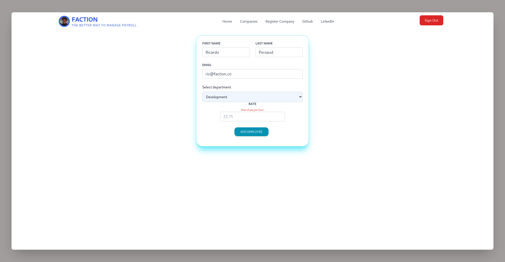

<h1 align="center">Welcome to Faction 👋</h1>
<p align="center"><small >A better way to manage payroll.</small></p>
<p>
  <a href="https://www.npmjs.com/package/faction" target="_blank">
    
  </a>
  <a href="https://github.com/ricardo39985/faction" target="_blank">
    
  </a>
  <a href="https://opensource.org/licenses/MIT" target="_blank">
    
  </a>
</p>

> A fullstack application for payroll professionals to manage employee payment records for various organizations

<br>

### ✨ [Demo](https://faction.onrender.com/)

<br>

## Screenshots




<p align="right">(<a href="#readme-top">back to top</a>)</p>


## Technologies Used

The following tools were used in this project:


<p align="right">(<a href="#readme-top">back to top</a>)</p>

## Install

```sh
npm i
```a

## Usage

```sh
node server.js
```
<p align="right">(<a href="#readme-top">back to top</a>)</p>


## Roadmap

- [x] Add Changelog
- [x] Add Payment model
- [ ] Add Additional Templates w/ Examples
- [ ] Add more fields to Employee model
    - [ ] Hired
    - [ ] Reports to
    - [ ] SSN

See the [open issues](https://github.com/ricardo39985/faction/issues) for a full list of proposed features (and known issues).

<p align="right">(<a href="#readme-top">back to top</a>)</p>

## Author

👤 **Ricardo Persaud**

* Github: [@ricardo39985](https://github.com/ricardo39985)
* LinkedIn: [@ricardopersaudcodes](https://linkedin.com/in/ricardopersaudcodes)

## 🤝 Contributing

Contributions, issues and feature requests are welcome!<br />Feel free to check [issues page](https://github.com/ricardo39985/faction/issues).

## Show your support

Give a ⭐️ if this project helped you!

## 📝 License

Copyright © 2022 [Ricardo Persaud](https://github.com/ricardo39985).<br />
This project is [MIT](https://opensource.org/licenses/MIT) licensed.

***
_This project was built with ❤️ by [Ricardo Persaud](https://github.com/ricardo39985)_
